# Development
First import the project into IntelliJ

##  Import Project
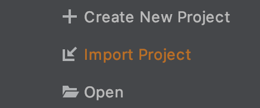

##  Select `Create from exising source`
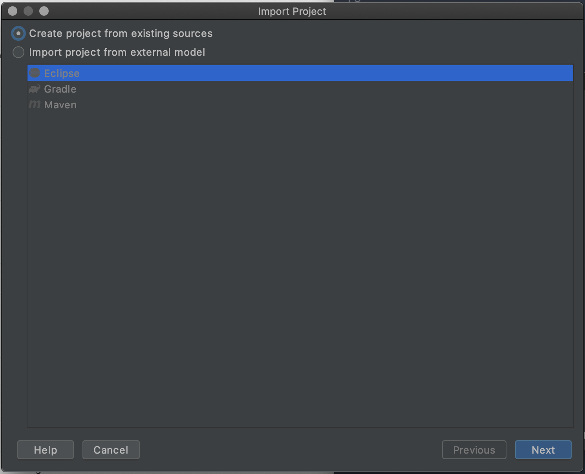

## Set Project name
Leave as is

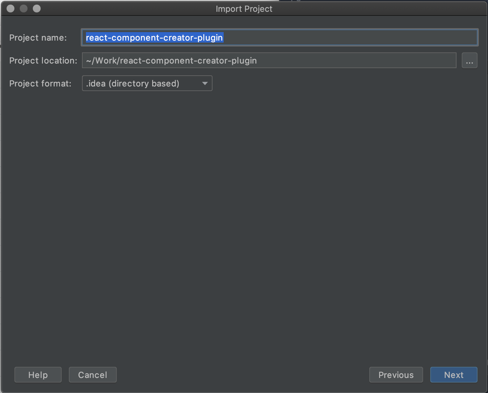

## Import
Leave as is

## Libraries
Leave as is

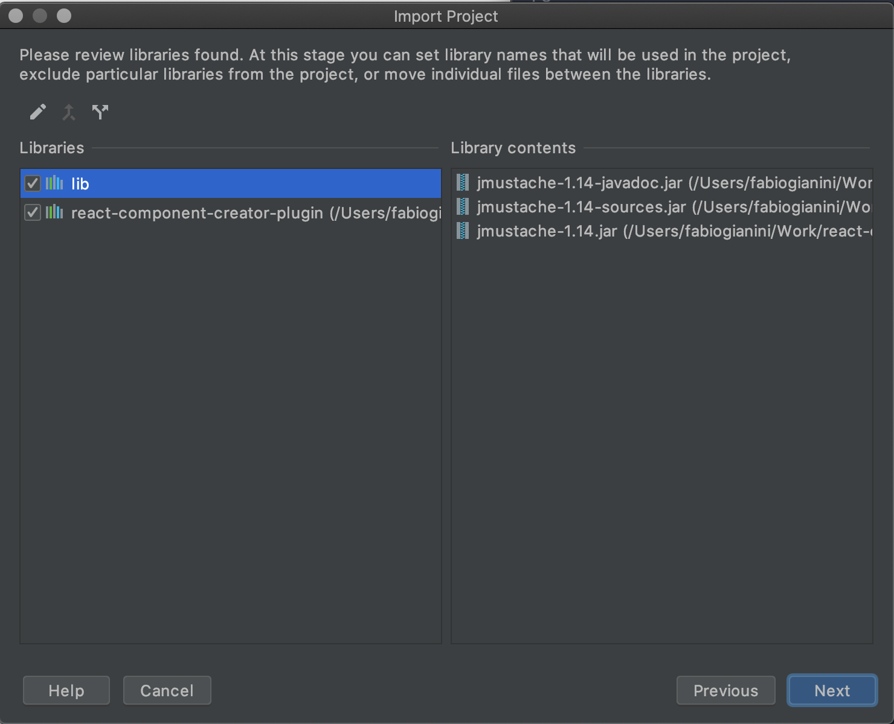

## Modules
Leave as is

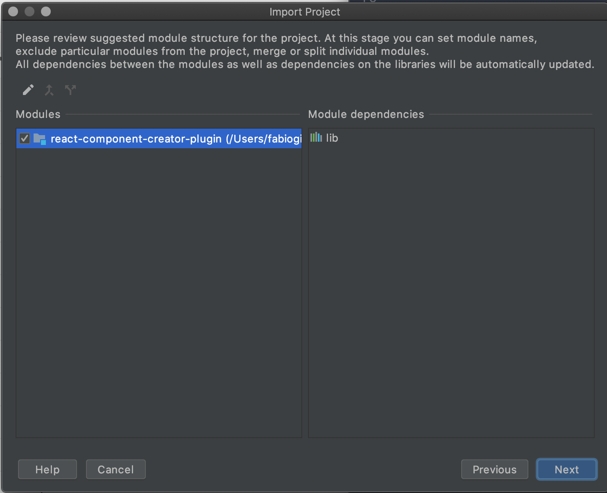

## Project iml file
Make sure to reuse the existing one

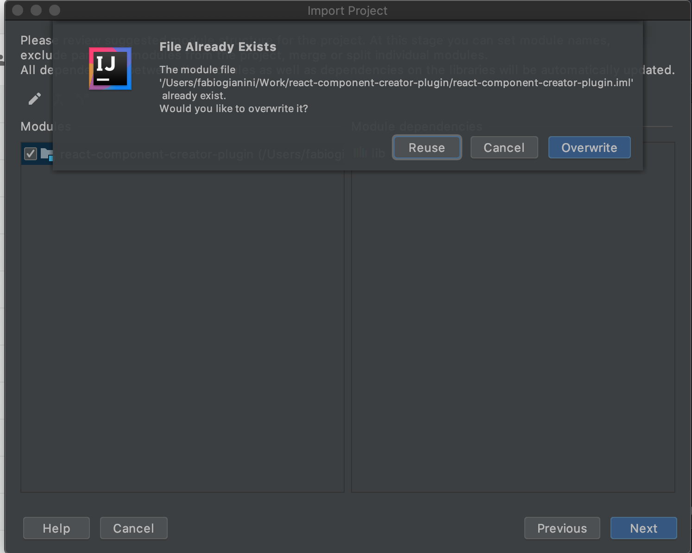

## SDK
Leave as is

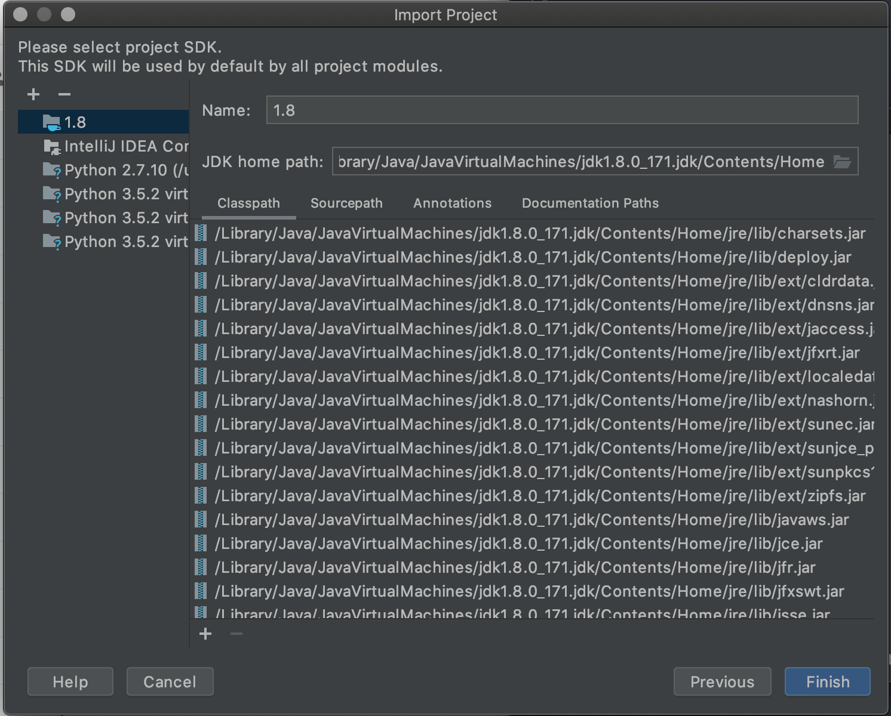

# Setup
Follow the setup to start developing the plugin

## Open Project Settings

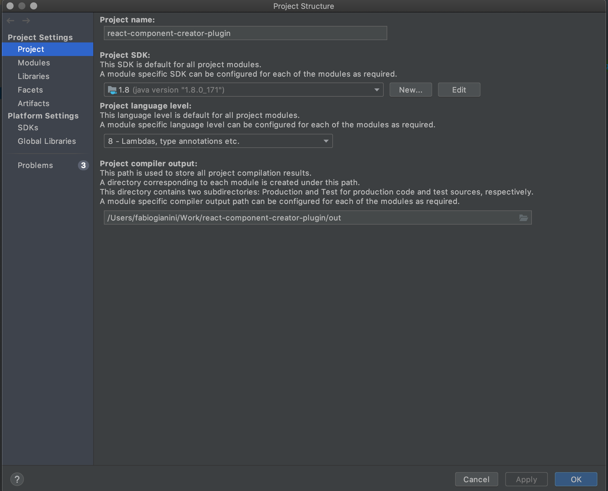

## Add "library"
In `Libraries` make sure to read `com.samskivert:jmustache:1.14` as maven dependency
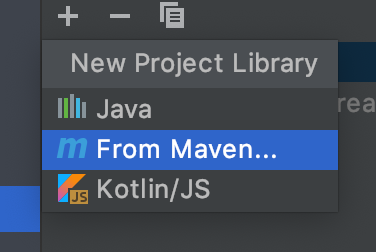

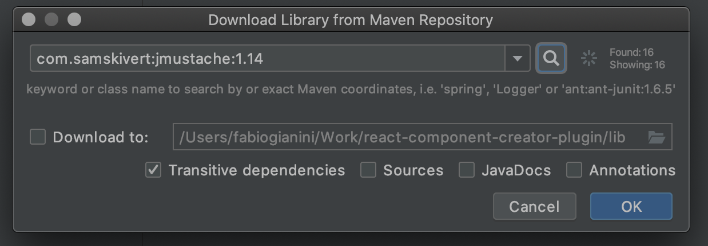

# Add Plugin Run configuration

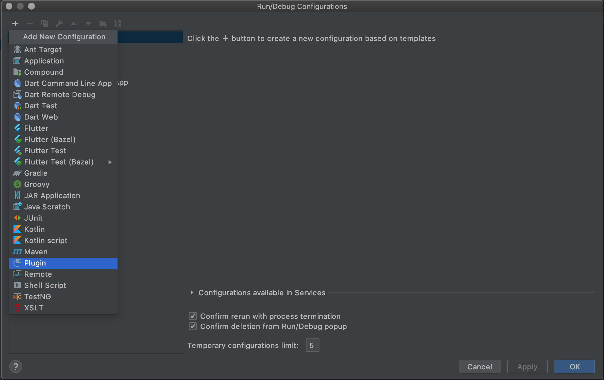

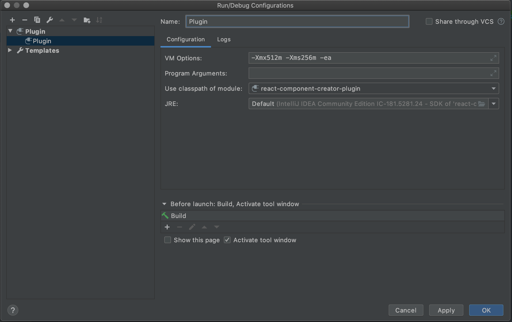
